# DQIMS - Complete Database Diagrams Guide
# For Defense Presentation & Project Documentation

---

## 📊 ENTITY RELATIONSHIP DIAGRAM (ERD)

### Main ERD Structure

```
┌─────────────┐         ┌──────────────┐         ┌─────────────┐
│    users    │1      N │    issues    │N      1 │ departments │
│─────────────│◄────────│──────────────│────────►│─────────────│
│ PK id       │         │ PK id        │         │ PK id       │
│ UK employee_id        │ FK reported_by         │ UK name     │
│ UK email    │         │ FK assigned_to         └─────────────┘
│    name     │         │ FK closed_by │
│    phone    │         │    title     │
│ password_hash         │ description  │
│    role     │         │    source    │
│ department  │         │  issue_type  │
└─────────────┘         │  severity    │
       │1               │  priority    │
       │                │   status     │
       │                └──────────────┘
       │                       │1
       │                       │
       │                       │N
       │                ┌──────────────────┐
       │                │ issue_attachments│
       │                │──────────────────│
       │                │ PK id            │
       │                │ FK issue_id      │
       │                │ FK uploaded_by   │
       │                │   file_name      │
       │                │   file_path      │
       │                └──────────────────┘
       │                       │N
       │                ┌──────────────────┐
       │                │ issue_comments   │
       │                │──────────────────│
       │                │ PK id            │
       │                │ FK issue_id      │
       │                │ FK user_id       │
       │                │   content        │
       │                └──────────────────┘
       │
       │1              ┌──────────────────┐
       └──────────────►│  notifications   │
                N      │──────────────────│
                       │ PK id            │
                       │ FK user_id       │
                       │ FK issue_id      │
                       │    type          │
                       │    title         │
                       │   message        │
                       │   is_read        │
                       └──────────────────┘
```

### Full Table Relationships

1. **users** (Central table)
   - One user can report many issues
   - One user can be assigned to many issues
   - One user can close many issues
   - One user can have many notifications
   - One user can upload many attachments
   - One user can write many comments

2. **issues** (Core business table)
   - Many issues belong to one department
   - Many issues reported by one user
   - Many issues assigned to one user (optional)
   - Many issues closed by one user (optional)
   - One issue has many attachments
   - One issue has many comments
   - One issue triggers many notifications

3. **departments**
   - One department has many users
   - One department has many issues

---

## 🎨 PLANTUML CODE

### Complete ERD in PlantUML

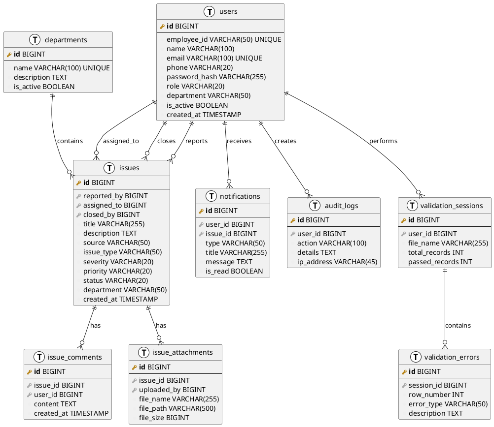

---

## 📈 ACTIVITY DIAGRAMS

### 1. User Login Flow

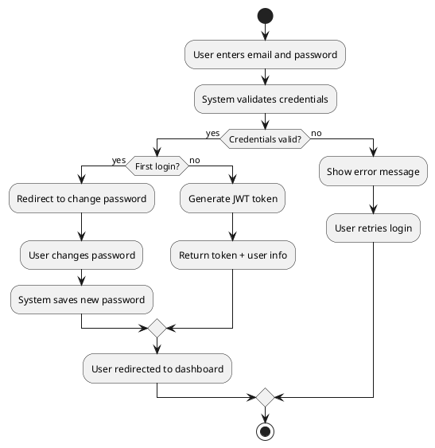

### 2. Create Issue Flow

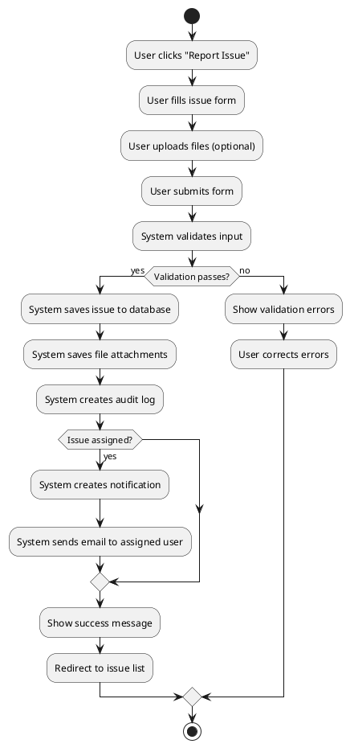

### 3. Issue Lifecycle

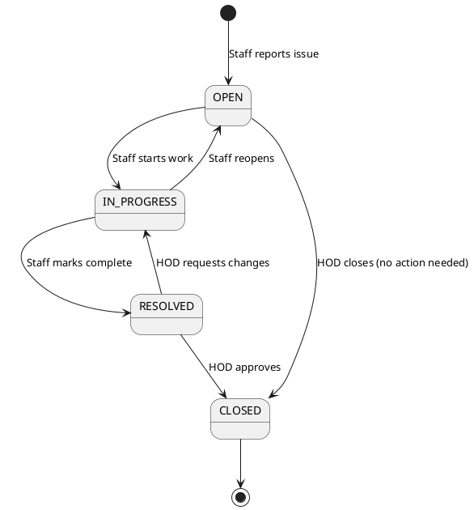

### 4. Data Validation Flow

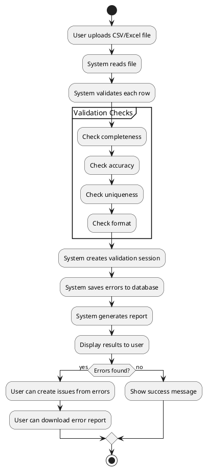

### 5. HOD Assign Issue

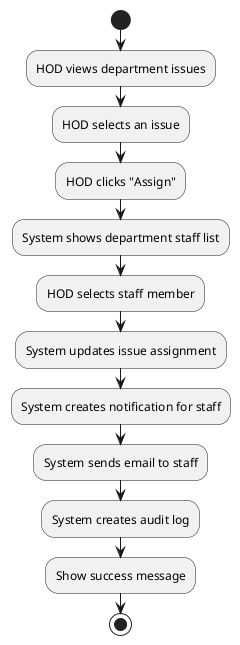

---

## 🏗️ SYSTEM ARCHITECTURE DIAGRAM

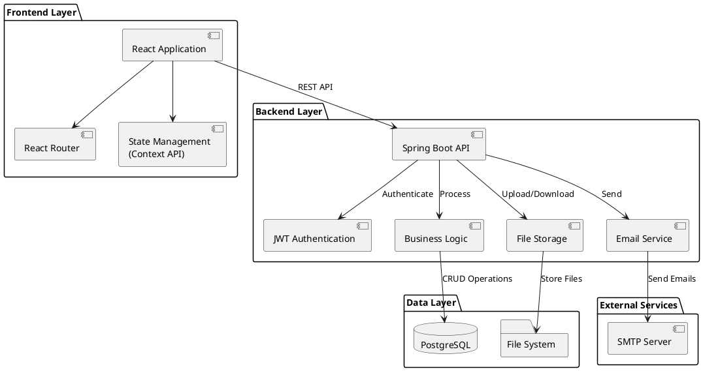

---

## 📊 CLASS DIAGRAM (Simplified)

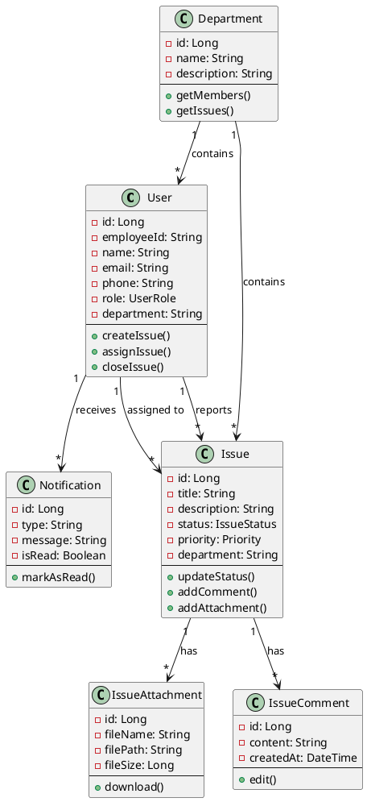

---

## 🔄 SEQUENCE DIAGRAMS

### Login Sequence

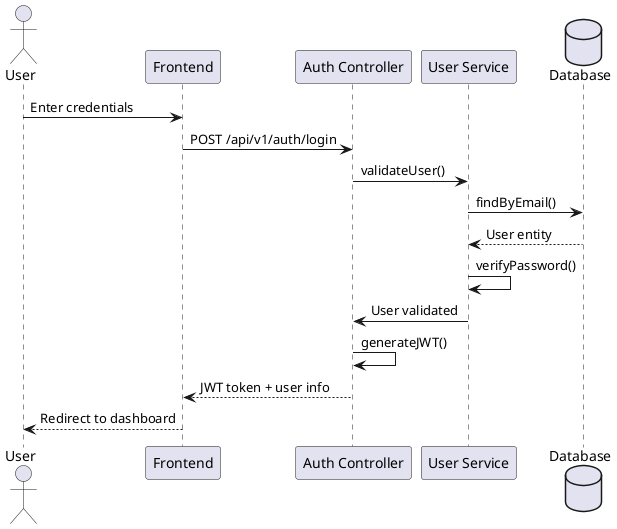

### Create Issue Sequence

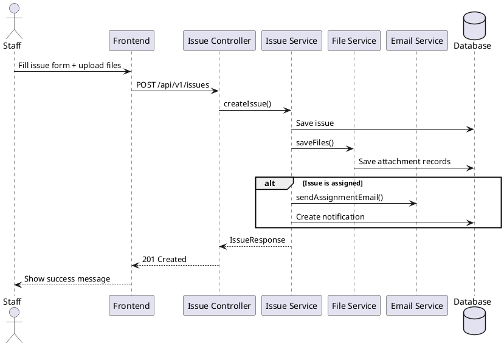

---

## 📐 USE CASE DIAGRAM

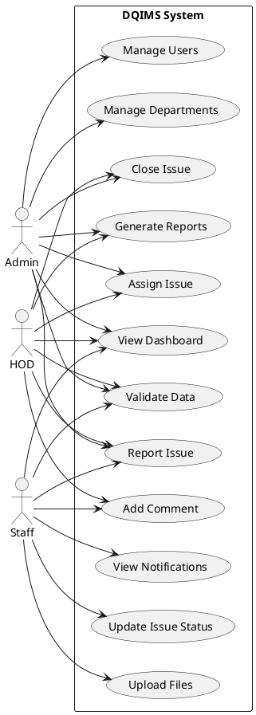

---

## 🎯 HOW TO DRAW DIAGRAMS

### Option 1: PlantUML Online Editor
1. Go to http://www.plantuml.com/plantuml/uml/
2. Copy any diagram code above
3. Paste and view
4. Export as PNG/SVG

### Option 2: VS Code
1. Install PlantUML extension
2. Create `.puml` file
3. Paste diagram code
4. Press Alt+D to preview
5. Export as image

### Option 3: Draw.io
1. Go to https://app.diagrams.net/
2. Manually draw using shapes
3. Use template for ERD
4. Export as PNG/PDF

### Option 4: Lucidchart
1. Sign up at lucidchart.com
2. Use ERD template
3. Add all 10 tables
4. Connect relationships
5. Export

---

## 📋 TABLES SUMMARY FOR DIAGRAMS

| Table | Primary Key | Foreign Keys | Purpose |
|-------|------------|--------------|---------|
| users | id | - | User authentication & profiles |
| departments | id | - | Department management |
| issues | id | reported_by, assigned_to, closed_by | Issue tracking |
| issue_attachments | id | issue_id, uploaded_by | File storage |
| issue_comments | id | issue_id, user_id | Discussion threads |
| notifications | id | user_id, issue_id | Real-time alerts |
| audit_logs | id | user_id | Activity tracking |
| validation_sessions | id | user_id | Data validation history |
| validation_errors | id | session_id | Validation error details |
| password_history | id | user_id | Password security |

---

## 🎓 FOR YOUR DEFENSE PRESENTATION

### Recommended Diagrams to Show:

1. **ERD** - Shows complete database structure (MUST HAVE)
2. **System Architecture** - Shows frontend-backend-database (MUST HAVE)
3. **Issue Lifecycle** - Shows business process flow (HIGHLY RECOMMENDED)
4. **Login Sequence** - Shows authentication flow (RECOMMENDED)
5. **Use Case Diagram** - Shows system features by role (RECOMMENDED)

### Presentation Tips:

- **Start with ERD** - Explain all 10 tables
- **Show relationships** - One-to-many, many-to-one
- **Explain foreign keys** - How tables connect
- **Demo System Architecture** - Frontend → Backend → Database
- **Walk through flows** - Login, Create Issue, Assign Issue
- **Explain role-based access** - Who can do what

---

**All diagrams are ready for your defense and documentation! Good luck! 🎓📊**
